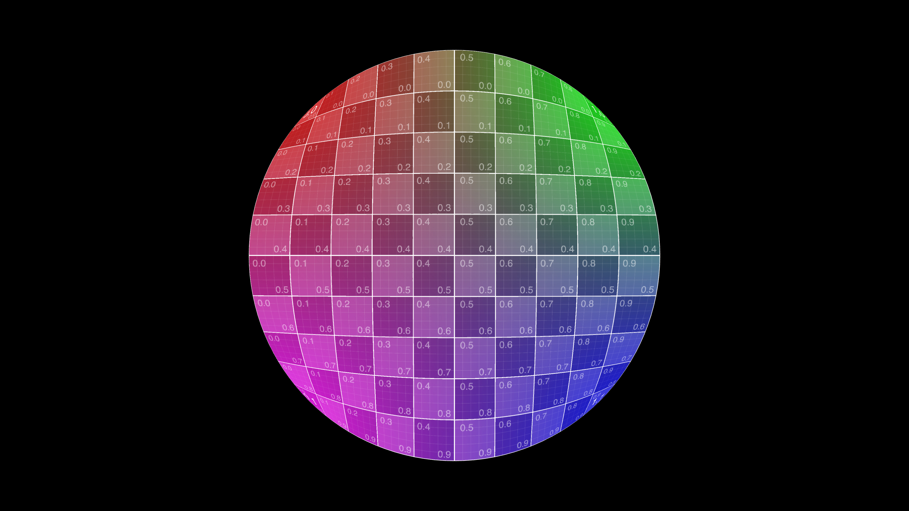

# Elliptical mapping

Based on the paper [Elliptification of Rectangular Imagery](https://arxiv.org/pdf/1709.07875.pdf) from Chamberlain Fong, I have implemented the mappings that can be used for the following geometries UVs generation: ellipse, disc, superellipse, squircle, annulus and reuleux geometries.

## All Mappings

## Rectangular

## Radial

## Concentric

## Lamé

## Elliptical

## Fg Squircular

## Two Squircular

## Three Squircular

## Cornerific Tapered2

## Tapered4

## Non Axial2 Pinch

## Non Axial Half Pinch

## Squelched

## Squelched Vertical

## Squelched Horizontal

